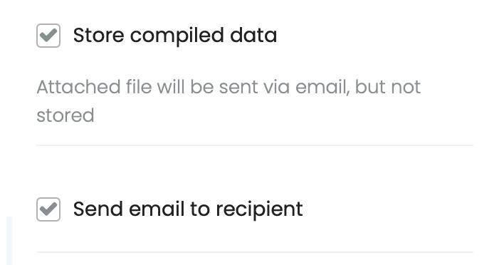
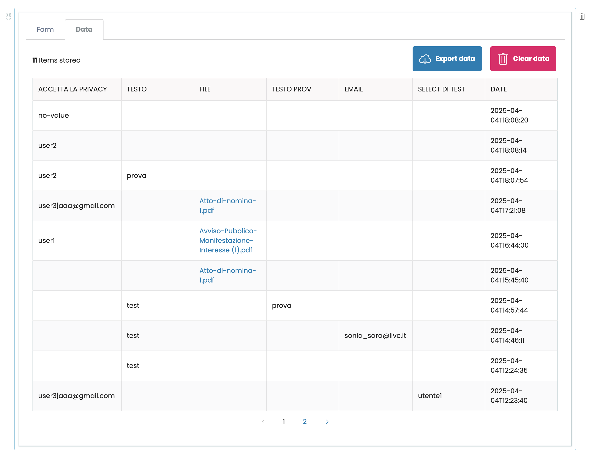

# volto-form-block

Volto addon which adds a customizable form using a block.
Intended to be used with [collective.volto.formsupport](https://github.com/collective/collective.volto.formsupport).

Install with mrs-developer (see [Volto docs](https://docs.voltocms.com/customizing/add-ons/)) or with:

```bash
yarn add volto-form-block volto-subblocks
```

> [!NOTE]
> - Since version v2.0.0 of this add-on, [`collective.volto.formsupport`](https://github.com/collective/collective.volto.formsupport) 2.0.0 or later and performing its upgrade steps is required.
> - Since version v2.1.2 of this add-on, Volto 14.2.0 or later is required.
> - Since version v3.0.0 of this add-on, Volto 16.0.0-alpha.38 or later is required.
> - Since version v3.11.0 of this add-on, [`collective.volto.formsupport`](https://github.com/collective/collective.volto.formsupport) 3.1.4 or later is required.
> - Since version v3.13.0 of this add-on, [`collective.volto.formsupport`](https://github.com/collective/collective.volto.formsupport) 3.3.0 or later is required.

## Features

This addon will add in your project the Form block and the needed reducers.


Using the engine of sub-blocks, you can manage form fields by adding, sorting, and deleting items.

For each field, you can select the field type from:

- Text
- Textarea
- Select
- Single choice (radio buttons)
- Multiple choice (checkbox buttons)
- Checkbox
- Date picker
- File upload with DnD
- E-mail
- Static rich text (not a fillable field, just text to display between other fields)

For every field you can set a label and a help text.
For select, radio and checkbox fields, you can select a list of values.

## Captcha verification

This form addon is configured to work with [HCaptcha](https://www.hcaptcha.com), [ReCaptcha](https://www.google.com/recaptcha/) and
[NoRobot](https://github.com/collective/collective.z3cform.norobots) to prevent spam.

In order to make one of these integrations work, you need to add
[plone.formwidget.hcaptcha](https://github.com/plone/plone.formwidget.hcaptcha) and/or
[plone.formwidget.recaptcha](https://github.com/plone/plone.formwidget.recaptcha) and/or
[collective.z3cform.norobots](https://github.com/collective/collective.z3cform.norobots)
Plone addon and configure public and private keys in the control panels.

### HCaptcha

With HCaptcha integration, you also have an additional option in the sidebar in 'Captcha provider' to enable or disable the invisible captcha (see implications [here](https://docs.hcaptcha.com/faq#do-i-need-to-display-anything-on-the-page-when-using-hcaptcha-in-invisible-mode)).

In some test scenarios it's found that the "Passing Threshold" of HCaptcha must be configured as "Auto" to get the best results. In some test cases if one sets the Threshold to "Moderate" HCaptcha starts to fail.

### OTP email validation

To prevent sending spam emails to users via the email address configured as sender, the 'email' fields type flagged as BCC will require the user to enter an OTP code received at the address entered in the field when user fills out the form.

## Export

With backend support, you can store data submitted from the form.
In Edit, you can export and clear stored data from the sidebar.



In the most recent versions of the form, a table has been introduced for consulting the saved data.


## Additional fields

In addition to the fields described above, you can add any field you want.
If you need a field that is not supported, PRs are always welcome, but if you have to use a custom field tailored on your project needs, then you can add additional custom fields.

```jsx
config.blocks.blocksConfig.form.additionalFields.push({
  id: 'field type id',
  label:
    intl.formatMessage(messages.customFieldLabel) ||
    'Label for field type select, translation obj or string',
  component: MyCustomWidget,
  isValid: (formData, name) => true,
});
```

The widget component should have the following firm:

```js
({
  id,
  name,
  title,
  description,
  required,
  onChange,
  value,
  isDisabled,
  invalid,
}) => ReactElement;
```

You should also pass a function to validate your field's data.
The `isValid` function accepts `formData` (the whole form data) and the name of the field, thus you can access to your fields' data as `formData[name]` but you also have access to other fields.

`isValid` has the firm:

```js
(formData, name) => boolean;
```

Example custom field [here](https://gist.github.com/nzambello/30949078616328e6ee0293e5b302bb40).

## Static fields

In backend integration, you can add in block data an object called `static_fields` and the form block will show those in form view as readonly and will aggregate those with user compiled data.

i.e.: aggregated data from user federated authentication:


## Schema validators

If you want to validate configuration field (for example, testing if 'From email' is an address of a specific domain), you could add your validation functions to block config:

```js
config.blocks.blocksConfig.form = {
  ...config.blocks.blocksConfig.form,
  schemaValidators: {
    fieldname: yourValidationFN(data),
  },
};
```

`yourValidationFN` have to return:

- null if field is valid
- a string with the error message if field is invalid.

## Upgrade guide

To upgrade to version 2.4.0 you need to:

- Remove the env vars
- Install [plone.formwidget.hcaptcha](https://github.com/plone/plone.formwidget.hcaptcha) or [plone.formwidget.recaptcha](https://github.com/plone/plone.formwidget.recaptcha) or both in Plone.
- Insert private and public keys in Plone HCaptcha control panel and/or Plone ReCaptcha control panel.

## Video demos

- [Form usage](https://youtu.be/v5KtjEACRmI)
- [Form editing](https://youtu.be/wmTpzYBtNCQ)
- [Export stored data](https://youtu.be/3zVUaGaaVOg)

## VERSIONS

With volto-form-block@2.5.0 you need to upgrade [collective.volto.formsupport](https://github.com/collective/collective.volto.formsupport) to version 2.4.0
