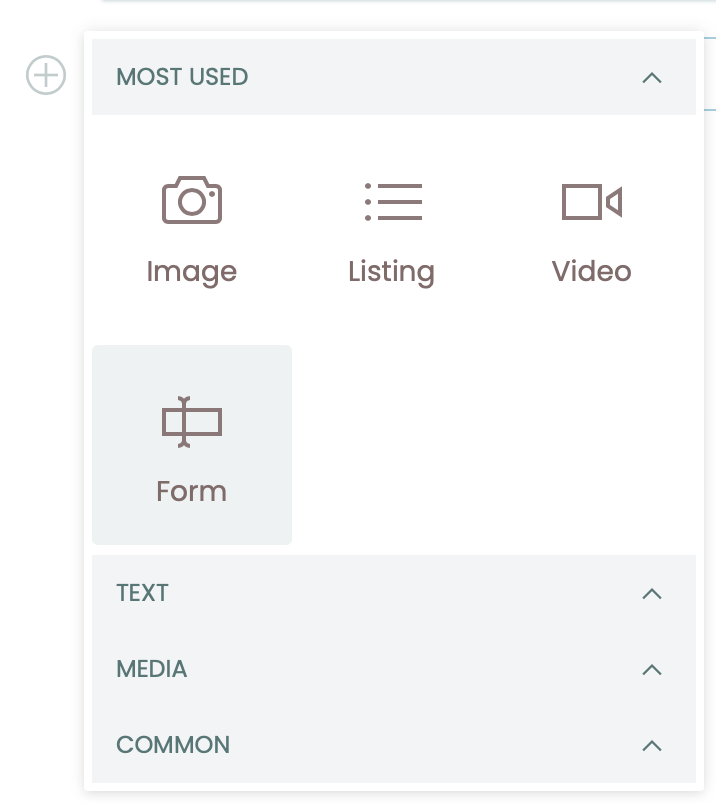
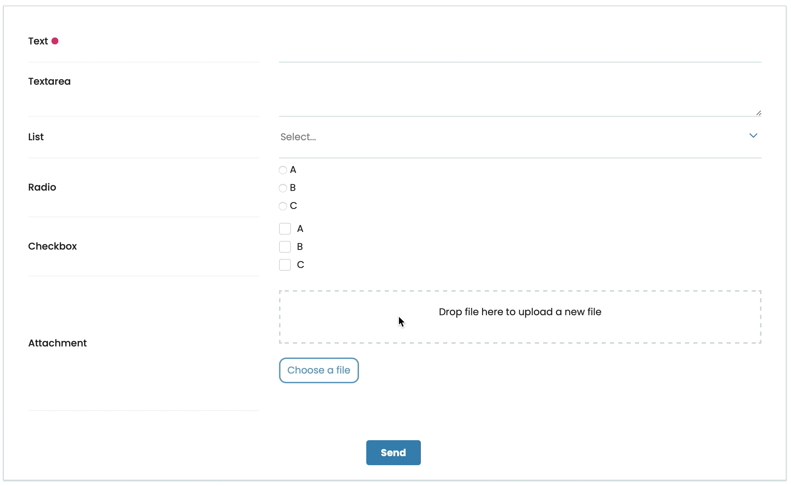

# volto-block-form

Volto addon which adds a customizable form using a block.  
Intended to be used with [collective.volto.formsupport](https://github.com/collective/collective.volto.formsupport).

Install with mrs-developer (see [Volto docs](https://docs.voltocms.com/customizing/add-ons/) or with:

```bash
yarn add volto-form-block
```

## Features

This addon will add in your project the Form block and the needed reducers.





Using the engine of subblocks, you can manage form fields adding, sorting and deleting items.

For each field, you can select the field type from:

- Text
- Textarea
- Select
- Radio buttons
- Checkbox buttons
- Date picker
- File upload with DnD
- E-mail

For every field you can set a label and a help text.
For select, radio and checkbox fields, you can select a list of values.

## Export

With backend support, you can store data submitted from the form.
In Edit, you can export and clear stored data from the sidebar.


## Static fields

In backend integration, you can add in block data an object called `static_fields` and the form block will show those in form view as readonly and will aggregate those with user compiled data.

i.e.: aggregated data from user federated authentication:


## Video demos

- [Form usage](https://youtu.be/v5KtjEACRmI)
- [Form editing](https://youtu.be/wmTpzYBtNCQ)
- [Export stored data](https://youtu.be/3zVUaGaaVOg)
